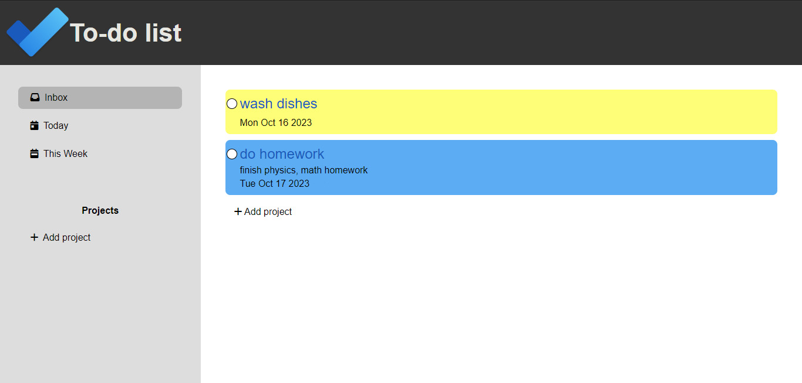

<h1 align = 'center'> To-Do List </h1>

This web application is designed to streamline your task management and boost your productivity. With the ability to add, delete, and organize tasks, create custom projects, and prioritize your to-dos, you'll stay on top of your responsibilities with ease.

## Project Overview

- **Project Name**: To-Do List
- **URL**: [https://khaled0p.github.io/To-Do-List/](https://khaled0p.github.io/To-Do-List/)

## Introduction

The To-Do List website is your all-in-one solution for managing tasks, projects, and deadlines. It empowers you to:

- Add tasks with a title, description, date, and priority.
- Organize tasks within custom projects for efficient project management.
- Automatically categorize tasks into "Today," "Tomorrow," and "This Week" based on their due dates.
- Easily delete tasks you've completed.
- Tasks colors change to visually highlight priorities.

This project embraces the 'date-fns' library to provide seamless date-based task categorization and utilizes the Local Storage API for persistent data storage. With this website, you'll achieve better task management, improved productivity, and a clear path to success.

## Features

- Create and manage tasks with titles, descriptions, dates, and priorities.
- Categorize tasks into "Today," "Tomorrow," and "This Week."
- Efficiently delete completed tasks.
- Organize tasks within custom projects for streamlined project management.
- Your task data is securely saved, ensuring your tasks are preserved even when you return to the website.

## Built With

- **JavaScript** - The primary programming language used in this project.
- [Webpack](https://webpack.js.org/) - Build tool for managing dependencies, bundling assets, and optimizing the project.
- ['date-fns'](https://date-fns.org/) - A popular JavaScript library for handling dates and categorizing tasks based on their due dates.
- **Local Storage API** - Utilized for storing user data and task progress locally in the browser, ensuring persistent data between sessions.

Stay organized, stay productive, and make the most of your time with the To-Do List website.
